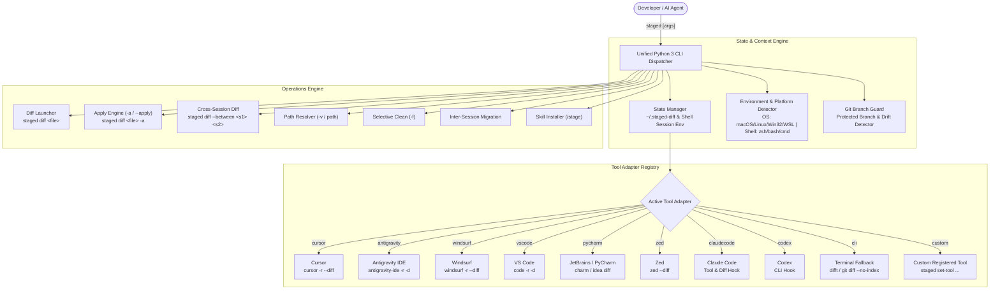
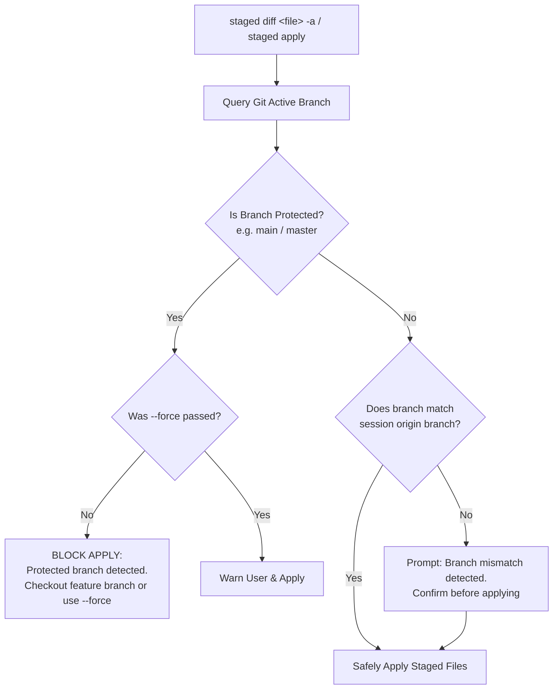

# Specification Document: Unified Staging Engine (`staged`) & `/stage` Skill 2.0

**Document Version:** `2.0.0`  
**Date:** October 2, 2026  
**Status:** Approved Architecture & Engineering Specification  
**Package:** `@melchi/staged` (CLI: `staged`, Skill: `/stage`)  
**Target Audience:** Core Maintainers, Contributing Developers, AI Agents

---

## 1. 60-Second Developer Onboarding Guide

```bash
# 1. Clone repository
git clone https://github.com/melchi-shared-useful.git
cd melchi-shared-useful/packages/staged

# 2. Link CLI to user PATH
ln -sfn "$(pwd)/scripts/staged" ~/.local/bin/staged
ln -sfn "$(pwd)/scripts/staged" ~/.local/bin/stage

# 3. Install completion
staged --install-completion

# 4. Install /stage skill for your IDE (e.g. Cursor)
staged install-skill --tool cursor --default

# 5. Tell your AI Assistant:
# "Use /stage to stage changes in an isolated sandbox first."

# 6. Review & Apply:
# staged                          # List staged files
# staged diff Player.svelte       # Inspect diff in IDE
# staged diff Player.svelte -a    # Apply staged changes!
```

---

## 2. Executive Summary & Motivation

### 2.1 Background & Design Nomenclature

The **Staging Workflow** isolates AI agent code changes, refactors, and file generation outside of the active Git working tree. Instead of polluting working repositories or requiring heavy Git worktree lifecycle management, proposed edits are staged as real files on disk within an isolated session directory.

To ensure crystal-clear mental models, version 2.0 formalizes the semantic distinction between the CLI manager and the agent skill:

- **`staged` (CLI Script)**: Represents the inspection and management tool for everything that is currently _staged_ on disk (e.g. `staged`, `staged diff <file>`, `staged clean`). A symlink `stage` is also provided for convenience.
- **`/stage` (Agent Skill)**: Represents the imperative action / slash command instructing the AI assistant to perform the staging operation (e.g. _"Use `/stage` to prepare these refactors"_).

### 2.2 Pain Points Addressed

1. **Split Tooling**: Earlier versions maintained separate scripts (`staged-diff` and `staged-diff-cursor`), causing maintenance overhead and fragmented configurations.
2. **Applying Changes Ergonomics**: Developers inspecting a diff often want to apply that specific file's changes immediately without switching mental contexts or typing separate verbose subcommands:
   ```bash
   staged diff Player.svelte -a    # Open/apply that file's staged changes directly!
   ```
3. **Environment & User Coupling**: Scripts contained hardcoded macOS paths (e.g. `/Applications/Antigravity IDE.app/...`), Unix-only assumptions (symlinks, `~/.zfunc`), and user-specific directory layouts.
4. **Cross-Conversation Isolation & Stale File Risks**: Migrating work between conversations required manual disk moves, with no visibility into file freshness or cross-session differences, risking stale files overwriting new progress.
5. **Safety & Guardrails**: Staged changes could be applied to any Git branch without checking for branch protection (e.g. `main`, `master`, `production`) or divergent branch states.
6. **Command CLI Ergonomics**: Running `staged [command] --help` (e.g., `staged clean --help`) executed the command or triggered validation failures rather than rendering subcommand help. Additionally, `clean` lacked the ability to selectively purge a single staged file (`-f`).
7. **Tool Expansion Friction**: Developers using VS Code, Windsurf, PyCharm/IntelliJ, Zed, Codex, or Claude Code lacked an out-of-the-box adapter interface.

### 2.3 Mission & Design Principles

- **Canonical Script & Command**: **`staged`** (with optional alias `stage` and backward-compatible `staged-diff`).
- **Canonical Agent Skill**: **`/stage`**.
- **Fluid Diff & Apply Workflow (`staged diff <file> -a`)**:
  - `staged diff <file>`: Opens graphical side-by-side diff in the configured IDE.
  - `staged diff <file> -a` (or `--apply`): Immediately applies that specific file's staged changes to the workspace!
  - `staged diff all -a` (or `staged diff -a`): Applies all staged files to the workspace!
  - Note: Repository-wide listing is mapped to `-R` / `--all-repos`, reserving `-a` strictly for `--apply`.
- **Pure Python 3 Implementation**: Written strictly in standard-library Python 3. No `pip install`, no virtual environments, universally interpretable across all operating systems.
- **Out-of-the-Box Tool Suite**: Native adapter support from day one for:
  - **Cursor** (Recommended Default)
  - **Antigravity IDE**
  - **Windsurf**
  - **Zed**
  - **PyCharm / JetBrains**
  - **VS Code**
  - **Claude Code**
  - **Codex**
  - **Terminal / CLI Fallback**
- **First-Run Write Path Permissioning**: On initial setup, prompt for or establish the staging directory root and automatically permission that path as always read/write in tool sandboxes (treating staging as an inherently safe extension of the AI's brain).
- **Shell-Instance State Tracking (NVM-style)**: Support setting the active session and tool for the current shell instance (via `staged use <session>` or environment variables) as well as persistent defaults stored in `~/.staged-diff`.
- **Cross-Session Diffing**: Enable side-by-side graphical diffing of the _same file across two different sessions_ to compare agent approaches and prevent stale regressions (`staged diff --between <s1> <s2> <file>`).
- **Conversation ID in `/stage` Output**: Mandate that `/stage` displays the active Conversation ID prominently so developers can easily copy and switch between sessions.
- **Verbose Absolute Path Resolution (`-v` / `path`)**: Provide full, raw absolute filesystem paths so developers can click or copy-paste them directly into IDEs and terminals.
- **Universal Shell Support**: Native behavior and completions across **Zsh**, **Bash**, and **Windows CMD** (as well as PowerShell).
- **Branch Protection & Git Safety**: Guard against applying staged files directly to protected branches without explicit `--force`.

---

## 3. System Architecture & Multi-Tool Adapter Engine



### 3.1 The Adapter Contract

Every supported tool implements a clean Python class interface:

```python
class ToolAdapter:
    id: str                       # e.g. 'cursor', 'antigravity', 'windsurf', 'vscode'
    name: str                     # e.g. 'Cursor IDE'
    default_staging_root: str     # e.g. '~/.local/share/stage' or tool-specific path

    def get_diff_command(self, orig_file: str, staged_file: str) -> list[str]:
        """Command to open side-by-side diff."""
        pass

    def get_open_command(self, staged_file: str) -> list[str]:
        """Command to open a new file directly in the editor."""
        pass

    def detect_binary(self) -> str | None:
        """Locates tool executable on PATH or standard OS install paths."""
        pass

    def configure_sandbox(self, staging_path: str) -> bool:
        """Configures sandbox/write-permission allowlists for this IDE."""
        pass

    def install_skill(self, target_dir: str | None = None) -> str:
        """Installs the /stage skill into this tool's skill registry."""
        pass
```

### 3.2 Built-In Tool Configurations

| Tool ID           | Display Name       | Default Staging Root                                       | Diff Command Template                            | Binary Search Hierarchy                                                                                      |
| :---------------- | :----------------- | :--------------------------------------------------------- | :----------------------------------------------- | :----------------------------------------------------------------------------------------------------------- |
| **`cursor`**      | Cursor             | `~/.local/share/cursor-artifact-staging/<conv_id>/staging` | `cursor -r --diff {orig} {staged}`               | `cursor` on `PATH` &rarr; macOS `/Applications/Cursor.app/...` &rarr; `%LOCALAPPDATA%\Programs\cursor`       |
| **`antigravity`** | Antigravity IDE    | `~/.gemini/antigravity-ide/brain/<conv_id>/staging`        | `antigravity-ide -r -d {orig} {staged}`          | `PATH` &rarr; macOS `/Applications/Antigravity IDE.app/...` &rarr; Windows Registry                          |
| **`windsurf`**    | Windsurf IDE       | `~/.local/share/windsurf-staging/<conv_id>/staging`        | `windsurf -r --diff {orig} {staged}`             | `windsurf` on `PATH` &rarr; macOS `/Applications/Windsurf.app/...` &rarr; `%LOCALAPPDATA%\Programs\Windsurf` |
| **`vscode`**      | Visual Studio Code | `~/.local/share/stage/<conv_id>/staging`                   | `code -r -d {orig} {staged}`                     | `code` on `PATH` &rarr; standard install paths                                                               |
| **`pycharm`**     | PyCharm / IDEA     | `~/.local/share/stage/<conv_id>/staging`                   | `charm diff {orig} {staged}`                     | `charm`, `idea` on `PATH`                                                                                    |
| **`zed`**         | Zed Editor         | `~/.local/share/stage/<conv_id>/staging`                   | `zed --diff {orig} {staged}`                     | `zed` on `PATH`                                                                                              |
| **`claudecode`**  | Claude Code        | `~/.local/share/stage/<conv_id>/staging`                   | `difft {orig} {staged}` or system editor         | `claude` on `PATH`                                                                                           |
| **`codex`**       | OpenAI Codex CLI   | `~/.local/share/stage/<conv_id>/staging`                   | `difft {orig} {staged}` or system editor         | `codex` on `PATH`                                                                                            |
| **`cli`**         | Terminal Fallback  | `~/.local/share/stage/<conv_id>/staging`                   | `difft {orig} {staged}` or `git diff --no-index` | `difft` (difftastic) &rarr; `git` &rarr; `diff -u`                                                           |

### 3.3 First-Run Write Path Permissioning

On first execution (or via `staged init` / `staged install-skill`):

1. **Interactive Prompt:** If no staging path is configured, the CLI suggests the default staging path (e.g. `~/.local/share/stage`) and asks for confirmation.
2. **Sandbox Authorization:**
   - **Cursor:** Automatically merges `additionalReadwritePaths` into `~/.cursor/sandbox.json` and adds read/write tokens to `~/.cursor/cli-config.json`.
   - **Antigravity:** Authorizes directory in IDE brain permissions.
   - **Windsurf:** Updates Windsurf configuration allowlists where applicable.
3. **Brain Extension Philosophy:** By establishing this allowlist upfront, the staging path is permanently recognized as safe, eliminating approval popups during agent turns while strictly keeping the actual Git repository write-protected.

### 3.4 User and Agent Extensibility

Developers or AI agents can register additional tools dynamically:

```bash
# Register a custom editor
staged set-tool sublime \
  --name "Sublime Text" \
  --diff-cmd "subl -n --command 'sublime_merge_diff {orig} {staged}'" \
  --open-cmd "subl {staged}" \
  --root "~/.local/share/stage"

# Switch default tool to Cursor
staged set --tool cursor --default
```

---

## 4. Shell Instance State Tracking (NVM-Style)

### 4.1 Motivation

Frequently having to type `-s <UUID>` or `--tool <IDE>` across dozens of commands is tedious. Developers need the ability to lock a terminal shell to a specific session or tool—exactly how `nvm use <version>` works for Node.

### 4.2 State Management Hierarchy

```
Precedence Order (Highest to Lowest):
1. Explicit CLI Flags       (--session <UUID>, --tool <IDE>)
2. Shell Environment Vars   (STAGED_SESSION, STAGED_TOOL)
3. Shell Instance State     (~/.staged-diff/shell_sessions/<SHELL_PID>.json)
4. Repository Local Config  (<repo_root>/.staged-diff.json)
5. Global Default State     (~/.staged-diff/state.json or ~/.staged-diff)
6. Automatic Detection      (Most recently modified session for current Git repo)
```

### 4.3 Shell Session Commands

```bash
# Set active session for the current shell instance
staged use <session_id>

# Set active tool for current shell instance
staged use --tool cursor

# Reset shell instance to auto-detect
staged use --clear

# Set persistent default across all shells
staged set --default-session <session_id>
staged set --default --tool cursor
```

---

## 5. Renamed Skill: `/stage` & Conversation ID Integration

### 5.1 Renaming Specification

- **Skill Name:** Standardized strictly to **`/stage`** (directory: `stage`, YAML frontmatter: `name: stage`).
- **Slash Command:** Triggers via `/stage` in Antigravity, Cursor, Windsurf, Claude Code, and Codex.

### 5.2 Mandatory Conversation ID Output in `/stage`

To ensure easy switching and cross-conversation operations:

- Every `/stage` summary or review document (`staged_changes.md`) **must prominently print the active Conversation ID** at the top of the output.
- **Example Agent Dashboard Output:**

  ```markdown
  # Staged Changes Review

  > **Session ID:** `d488ba53-c7c7-4aa4-8c66-9be2661334b3`  
  > **Active Branch:** `feat/media-explorer`  
  > **Staging Path:** `/Users/melchi/.local/share/stage/d488ba53-c7c7-4aa4-8c66-9be2661334b3/staging`

  Quick Switch: `staged use d488ba53`
  Quick Apply: `staged diff Player.svelte -a`
  ```

### 5.3 Automated Skill Installation (`staged install-skill`)

```bash
# Install /stage skill for default or active tool
staged install-skill

# Install and configure for Cursor (recommended default)
staged install-skill --tool cursor --default

# Install for Windsurf, Antigravity, Claude Code, or VS Code
staged install-skill --tool windsurf
staged install-skill --tool antigravity
staged install-skill --tool claude
```

---

## 6. CLI Command Specification & Usage Reference

### 6.1 Invocation Syntax

```
staged [command] [options] [arguments]
stage [command] [options] [arguments]
```

### 6.2 Global Options

- `-s, --session <UUID>`: Override target session (supports UUID prefixes).
- `-t, --tool <IDE>`: Override active tool for this run (`cursor`, `windsurf`, `antigravity`, etc.).
- `-v, --verbose`: Enable verbose output with **full absolute paths** on disk.
- `-R, --all-repos`: List staging sessions across all repositories (reserving `-a` for `--apply`).
- `-h, --help`: Global help guarantee (never runs subcommands).

---

### 6.3 Subcommand Specifications

#### 1. Listing Staged Files (Default)

```bash
staged [-v] [-s <UUID>] [-t <IDE>]
```

- **Standard View:** Color-coded status tags (`[APPLIED]`, `[MODIFIED]`, `[NEW FILE]`, `[RENAMED]`, `[RELOCATED]`), relative paths, session UUID, and branch alert.
- **Verbose View (`-v` / `--verbose`):**
  - Outputs the **complete absolute path** for both the staged copy and the original workspace file:
    ```
    Staged Files (1 modified):
      [MODIFIED] src/lib/Player.svelte
        Staged:    /Users/melchi/.local/share/stage/d488ba53/staging/src/lib/Player.svelte
        Workspace: /Users/melchi/DevProjects/my-app/src/lib/Player.svelte
        Size:      4.2 KB (staged) vs 3.8 KB (workspace)
        Modified:  2 mins ago
    ```
  - Allows immediate terminal click-to-open or copy-paste into editors.

#### 2. Side-by-Side Diff & Inline Apply (`staged diff <file> [-a]`)

```bash
# Open side-by-side diff in configured IDE (fuzzy matching):
staged diff <filename>

# Immediately apply the staged changes for this specific file:
staged diff <filename> -a
staged diff <filename> --apply

# Open diffs for all modified files:
staged diff all

# Apply ALL staged files to the workspace:
staged diff all -a
staged diff -a
```

- **The `-a` / `--apply` Flag:**
  - Running `staged diff <file> -a` executes the apply engine specifically for that file, copying the staged version into the workspace and updating status tags.
  - Eliminates the need to switch commands between inspecting diffs and applying them.

#### 3. Cross-Session Diffing (`staged diff --between`)

```bash
# Diff the same file between two different conversations/sessions:
staged diff --between <session-1> <session-2> <filename>

# Or using session flag:
staged diff <filename> -s <session-1> --compare-session <session-2>
```

- **Purpose:** Compare how an AI agent implemented a file in Conversation A versus Conversation B.
- **Behavior:** Launches the active IDE diff engine with `<session-1>/staging/<file>` on the left and `<session-2>/staging/<file>` on the right.
- **Stale Prevention:** Directly inspect divergent approaches before migrating or applying.

#### 4. Absolute Path Resolver (`staged path`)

```bash
staged path [-s|--staged] [-w|--workspace] <filename>
```

- **Purpose:** Output raw absolute paths for shell scripting, CLI tools, or clipboard pipes:

  ```bash
  # Open raw file in Neovim
  nvim $(staged path --staged Player.svelte)

  # Copy workspace path to clipboard
  staged path -w Player.svelte | pbcopy
  ```

#### 5. Selective Cleaning (`staged clean -f`)

```bash
staged clean [-f|--file <filename>] [-y|--yes]
```

- **Single-File Purge (`-f <file>`):** Removes _only_ the matched file from the staging session and removes its tracking entry from `renames.json`.
- **Full Session Purge:** Cleans all staged files in the session. Prompts for confirmation if unapplied files exist (bypassable with `-y`).
- **Tab Completion & Fuzzy Match:** Full shell completion on `-f` completes staged files.

#### 6. Explicit Apply (`staged apply`)

```bash
staged apply [-f|--file] <filename>
staged apply all [--force]
```

- Standard apply command (equivalent to `staged diff <file> -a` and `staged diff all -a`).
- **Branch Protection Check:** Blocks applying directly to protected branches (see Section 8).

#### 7. Inter-Session Migration (`staged migrate`)

```bash
staged migrate --from <session_uuid> [--to <target_uuid>] [--file <pattern>]
```

- Copies staged files, `renames.json`, and metadata from a prior conversation into the current one.
- **Stale Check:** Warns if the source session's files are older than files already modified in the workspace or target session.

#### 8. Shell Session Binding (`staged use`)

```bash
staged use <session_uuid>
staged use --tool <IDE>
staged use --clear
```

#### 9. Settings Configuration (`staged set`)

```bash
staged set [--tool <IDE>] [--default] [--branch-protection <true|false>]
staged set-tool <id> --name <name> --diff-cmd <cmd> --open-cmd <cmd> [--root <path>]
```

#### 10. Help Guarantee (`--help` behavior)

- `staged [any_command] --help`
- `staged diff --help`
- **Global Intercept:** Intercepts `-h` / `--help` globally. Subcommand operations (such as file writes or deletions) **never execute** when `--help` is passed.

---

## 7. Cross-Platform & Cross-Shell Engineering

### 7.1 Operating System & Shell Matrix

| Environment        | Supported Shells                     | Path Handling                                           | Binary Launch Technique                                   |
| :----------------- | :----------------------------------- | :------------------------------------------------------ | :-------------------------------------------------------- |
| **macOS**          | Zsh, Bash                            | POSIX (`~`, `/Users/...`)                               | Direct exec / `open -a` fallback                          |
| **Linux**          | Bash, Zsh                            | POSIX (`$XDG_CONFIG_HOME`, `$XDG_DATA_HOME`)            | Direct exec                                               |
| **Windows Native** | CMD (`cmd.exe`), PowerShell (`pwsh`) | Windows paths (`C:\...`, `%LOCALAPPDATA%`, `%APPDATA%`) | `subprocess.run(shell=True)` for `.cmd` / `.bat` / `.exe` |
| **WSL**            | Bash, Zsh                            | Translates Linux &harr; Windows paths                   | Invokes host Windows IDE binaries or Linux native         |

### 7.2 Pure Python 3 Core (Zero Dependencies)

- Uses only Python standard library: `os`, `sys`, `json`, `shutil`, `subprocess`, `re`, `pathlib`, `argparse`, `filecmp`.
- Runs immediately on any machine with Python 3.8+.
- Path normalization via `pathlib.Path` and `os.path.normpath` prevents mixed slash or escaping issues on Windows CMD.

### 7.3 Shell Completions & Binary Symlinks

- The install script links `staged` (and `stage`) into `~/.local/bin` (or user PATH).
- Unified tab-completion scripts generated for:
  - **Zsh:** `_staged` (aliased to `_stage`)
  - **Bash:** `staged-completion.bash`
  - **Windows CMD:** Doskey macros and batch wrappers (`staged.cmd`, `stage.cmd`)
  - **PowerShell:** `Register-ArgumentCompleter`

---

## 8. Branch Protection & Git Safety Rules

### 8.1 Protected Branch Policy

To prevent accidental application of agent changes directly to trunk branches:

- **Default Protected Branches:** `['main', 'master', 'production', 'release/*', 'staging', 'develop']`
- Configurable per-repo in `.staged-diff.json` or globally in `~/.staged-diff/state.json`.



### 8.2 Safety Behaviors

1. **Protected Branch Halt:** If current branch matches a protected pattern, applying changes immediately aborts unless `--force` is explicitly provided.
2. **Branch Drift Warning:** If the developer switched branches after the session was created, a mismatch notice requires confirmation before applying.

---

## 9. Enhanced Fuzzy Matching & Indexing

### 9.1 Multi-Stage Match Pipeline

Queries for `staged diff <file>`, `staged clean -f <file>`, and `staged apply <file>` match via:

1. Exact relative path.
2. Exact filename / basename.
3. Subsequence / FZF-style characters (e.g. `pysv` &rarr; `Player.svelte`).
4. Levenshtein edit distance for typo tolerance.

### 9.2 Session Index Cache (`.index.json`)

Maintains a small, lightweight `.index.json` inside each session root containing relative paths, basenames, tokenized fragments, and mtimes for instant (<5ms) lookups.

---

## 10. Backward Compatibility & Migration Plan

### 10.1 Compatibility Aliases

- `staged-diff` and `staged-diff-cursor` are maintained as transparent wrappers:
  ```bash
  #!/bin/sh
  exec staged "$@"
  ```
- Existing staging directories under `~/.cursor/artifact-staging` and `~/.gemini/antigravity-ide/brain` continue to be discovered and indexed.

### 10.2 Implementation Phases

1. **Phase 1: Core CLI Refactoring (Python 3)**
   - Introduce `staged` dispatcher (with `stage` symlink).
   - Implement `staged diff <filename>` and `staged diff <filename> -a`.
   - Fix `--help` global intercept guarantee.
   - Implement `staged path`, `-v` (verbose absolute paths), and `staged clean -f`.
2. **Phase 2: Tool Adapter Engine & State Manager**
   - Implement adapters for Cursor, Antigravity, Windsurf, VS Code, JetBrains, Zed, Claude Code, Codex.
   - Implement `staged use <session>` and persistent state in `~/.staged-diff`.
   - Implement first-run write path sandbox configuration.
3. **Phase 3: Cross-Session Diffing & Branch Guard**
   - Implement `staged diff --between <s1> <s2> <file>`.
   - Implement Git branch protection rules and drift warnings.
   - Implement `staged migrate` with stale-file checks.
4. **Phase 4: Shell Integration & Package Publishing**
   - Package under `@melchi/staged`.
   - Distribute `/stage` skill with automated installer (`staged install-skill`).
   - Generate shell completions for Zsh, Bash, CMD, and PowerShell.
